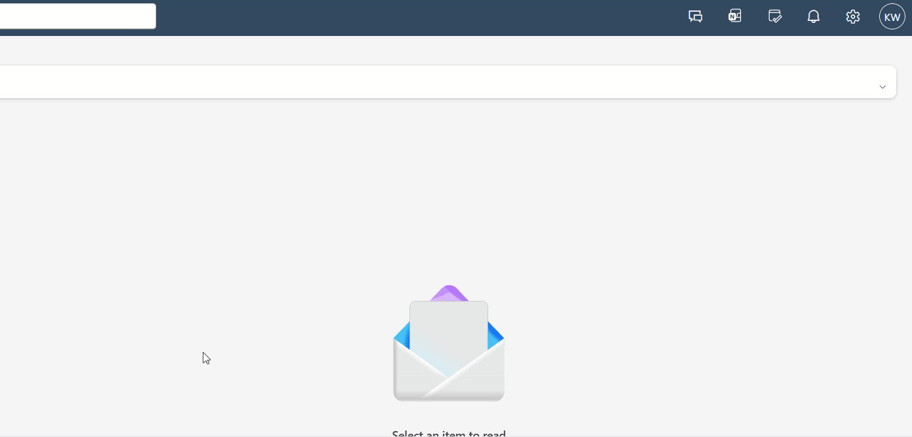
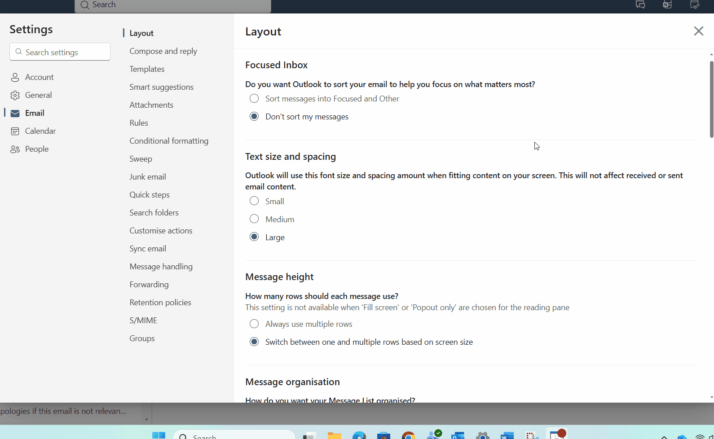
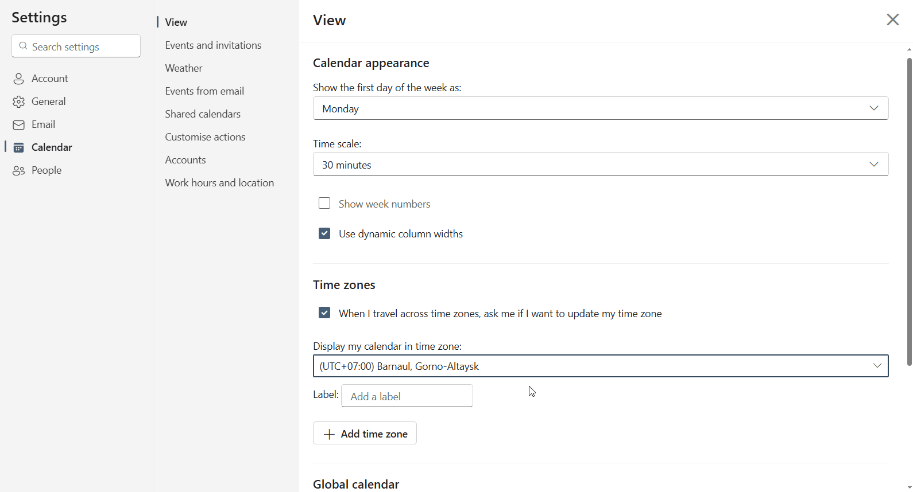

# How to change the time zone for your outlook account

1. Log into your outlook account on the web
2. Press the **gear icon** in the top right beside your profile icon

<figure><figcaption></figcaption></figure>

&#x20;

3. On the left go into the tab marked **Calendar**

<figure><figcaption></figcaption></figure>

&#x20;

4. Under **Time zones** look at “**Display my calendar in time zone**”, if it dosen’t say “**(UTC+00:00) Dublin, Edinburgh, Lisbon, London**” then follow step 5.

&#x20;

5. Press the down icon in the “**Display my calendar in time zone**” bar and scroll to “**(UTC+00:00) Dublin, Edinburgh, Lisbon, London**”, select it and press **Save**, after that a pop up will appear, press “**Yes, update**”.

<figure><figcaption></figcaption></figure>

<figure><figcaption></figcaption></figure>

&#x20;
